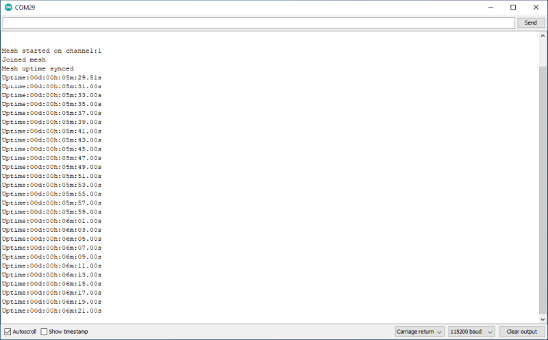

# Synced Blink

It is quite common to need a 'time signal' when working with a group of devices. m2mMesh has a common 'uptime' value, similar to the Arduino millis() value. This uptime is synced and so long as at least one member of the mesh remains and will constantly increase, eventually overflowing once the 32-bit unsigned integer used to hold it overflows after roughly 50 days.



The accuracy of the time sync is not high, it is 'human scale' so nearby nodes should be within 100ms of each other. As with node names, time sync can take up to five minutes to occur. The mesh tries to reach consensus on the uptime and the reported time may drift slightly until this happens.

This example should blink the onboard LED of most development boards and once the mesh is joined and the uptime synced they will flash in sync.

There is also a facility to share a real time clock and timezone across the mesh, working from this synced time value. See examples 9 and 10 for this. The RTC is only as accurate *m2mMesh.syncedMillis()* so again is 'human scale'.

## Methods for using synced time

```c++
bool m2mMesh.synced()
uint32_t m2mMesh.syncedMillis()
uint8_t m2mMesh.syncServer()
bool m2mMesh.amSyncServer()
```

To use synced uptime, check that sync has been achieved with *m2mMesh.synced()* then substitute *millis()* with *m2mMesh.syncedMillis()* in your code.

If running as the current sync server, m2mMesh.amSyncServer() returns true.

The current sync server can be found with m2mMesh.syncServer().